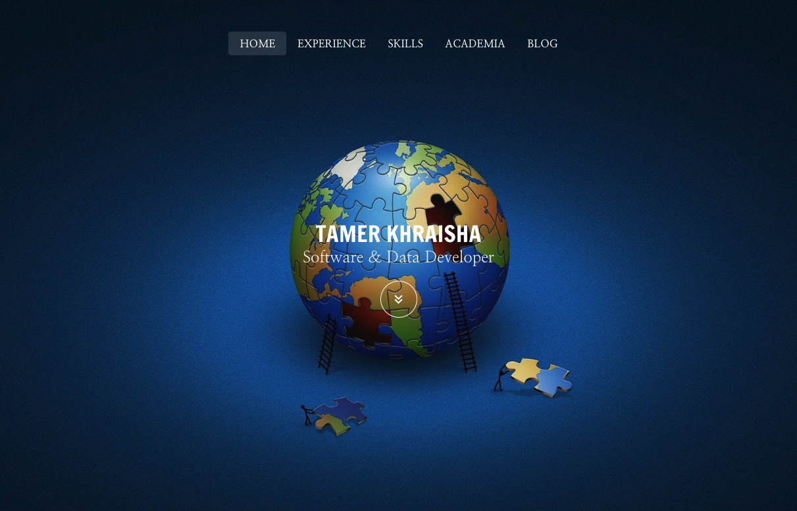

My personal webpage written in Vue and Vuetify
======
This is the official repository for the files I used in building my personal webpage. The webpage is written in Vue and powered by Vuetify.

<p align="start">
  <a href="https://vuetifyjs.com/en/" target="_blank">
    
  </a>
</p>


[Live webpage available here](http://tamerkhraisha.com/#/)


## Project setup
```
yarn install
```

### Compiles and hot-reloads for development
```
yarn run serve
```

### Compiles and minifies for production
```
yarn run build
```

### Run your tests
```
yarn run test
```

### Lints and fixes files
```
yarn run lint
```

### Customize configuration
See [Configuration Reference](https://cli.vuejs.org/config/).
